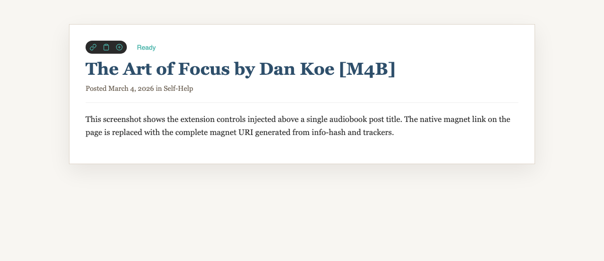
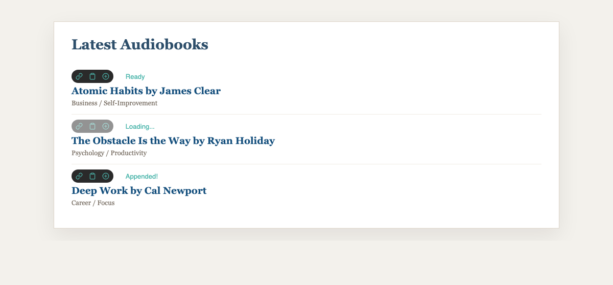
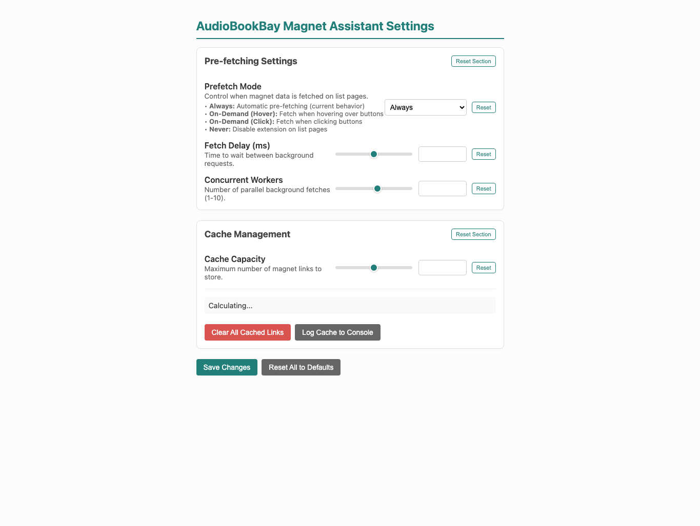

# AudioBookBay Magnet Assistant

Enhance your AudioBookBay experience with one-click magnet links, advanced clipboard tools, and high-speed pre-fetching. No login required.

[**Download for Firefox**](https://addons.mozilla.org/en-US/firefox/addon/audiobookbay-magnet-assistant/)

---

## 🚀 Key Features

### 1. Instant Magnet Links
Stop clicking through multiple pages. The assistant extracts the Info Hash and Trackers directly from the post to build a complete magnet link instantly.
*   **Direct Download:** Click the magnet icon to open your default torrent client.
*   **No Login Required:** Works even when you aren't signed into AudioBookBay.
*   **Native Overrides:** Automatically fixes the "broken" magnet links on the site to use the fully constructed versions.

### 2. Powerful Clipboard Tools
Manage your downloads with ease using integrated clipboard actions:
*   **📋 Copy:** Copy the full magnet link to your clipboard with one click.
*   **➕ Append:** Add multiple magnet links to your clipboard at once. Perfect for bulk-loading audiobooks into your client.
*   **✨ Smart Feedback:** Real-time status updates (e.g., "Copied!", "Appended!", "Duplicate!") let you know exactly what's happening.

### 3. Intelligent Pre-fetching (List View)
Browse faster with background pre-fetching. The assistant can "look ahead" and grab magnet data for every book in a list before you even click them.
*   **Lightning Fast:** Multi-threaded background workers fetch data in parallel.
*   **On-Demand Options:** Choose between "Always", "Hover", "Click", or "Never" depending on speed vs. bandwidth preferences.

---

## 📸 Screenshots

### Extension in Action (Post Page)

*The "Pill" UI appears right below the title, giving you instant access to download and clipboard tools.*

### High-Speed List View

*Browse search results or categories and see magnet controls injected for each book link.*

---

## ⚙️ Settings & Customization

The extension includes a robust settings page to tune performance to your needs.

### Pre-fetching Settings
*   **Prefetch Mode:** 
    *   `Always`: Fetch all magnet links on the page automatically.
    *   `On-Demand (Hover)`: Only fetch when you hover over the buttons.
    *   `On-Demand (Click)`: Only fetch when you actually click a button.
    *   `Never`: Disable the extension on list pages.
*   **Fetch Delay:** Add a delay between background requests to be respectful to the site's servers.
*   **Concurrent Workers:** Control how many background requests happen at the same time (1-10).

### Cache Management
*   **Cache Capacity:** Store up to 1000 magnet links locally (default: 100) so they load instantly when you revisit a page.
*   **Clear Cache:** Instantly wipe your local database of magnet links.
*   **Cache Stats:** See exactly how many links are currently stored in your local assistant.

---

## 🛠 Installation

1.  **Firefox:** Install via the [Official Add-on Store](https://addons.mozilla.org/en-US/firefox/addon/audiobookbay-magnet-assistant/).
2.  **Chrome/Edge (Manual):**
    *   Download the repository as a ZIP.
    *   Go to `chrome://extensions`.
    *   Enable **Developer Mode**.
    *   Click **Load Unpacked** and select the extension folder.

---

## 📄 License
This project is licensed under the MIT License. See the [LICENSE](LICENSE) file for details.
